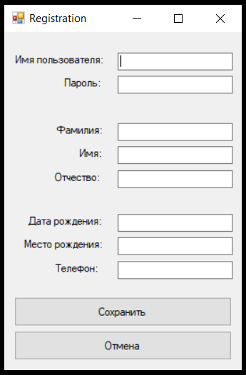

# Authorization
Information Security Lab | 2 course

## Screenshots

     Empty window to enter your personal account  
     Window with entered data  
     Message when login was successful  
     After clicking on the OK button in the message, the personal account window opens. Registered users can enter the account, view the MTUCI logo. They also have the ability to change their account password.  
     Change password window  
     Error when entering the same password.  
     Message when the password was successfully updated.  
     Message when the username and password are entered incorrectly  
     Empty user registration window  
     Registration window with entered data  
     Error if such login is already in the database  
     Message on successful user registration  
     New user login  
     The program greets the user by the name that was registered in the database   

